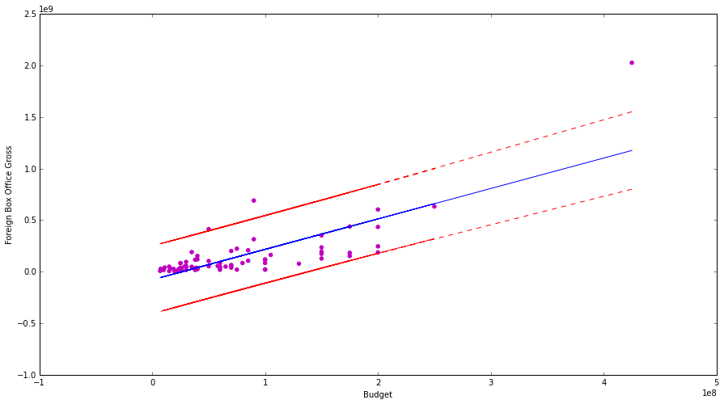
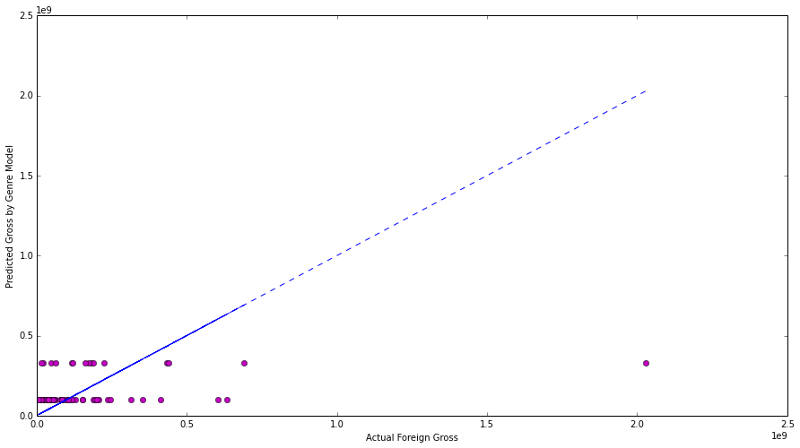
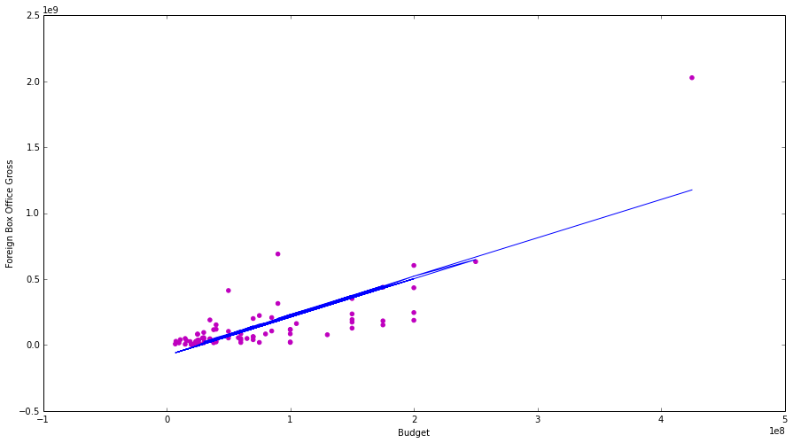

##Movie Data Check-in Submission Example and Instructions

I used a linear regression model with one feature to describe Box Office Total FOREIGN Gross as a function of the Budget of the Movie for top 100 best-grossing movies of 2009.

The figure depicts the model (blue) plotted against the actual datapoints (magenta). The confidence interval is plotted in red. 

I then fitted another regression line based on a the categorical variables "is an animated or cgi film" or "is not". 

This is the combination of the two previous models. 
